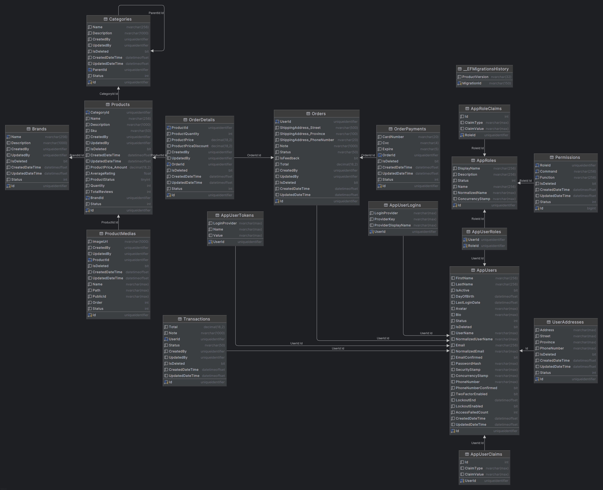

# RookieShop - Headphone Store

## Project Overview

RookieShop is a comprehensive e-commerce platform specialized in selling headphones and audio equipment. The system features a customer-facing storefront for browsing and purchasing products, as well as an admin backoffice for managing inventory, orders, and customer data. Built with modern web technologies and a clean architecture approach, the application offers a scalable and maintainable solution for online retail.

## Architecture

The project follows Clean Architecture principles with a clear separation of concerns:

```
RookieShop/
├── HeadphoneStore.API               # REST API endpoints and configuration
├── HeadphoneStore.Application       # Application business logic and use cases (CQRS with MediatR)
├── HeadphoneStore.Domain            # Core domain models, aggregates, and business rules
├── HeadphoneStore.Infrastructure    # External services integration (email, storage, etc.)
├── HeadphoneStore.Persistence       # Data access and database operations with EF Core
├── HeadphoneStore.Shared            # Shared DTOs, interfaces, and utilities
├── HeadphoneStore.StoreFrontEnd     # Customer-facing Blazor frontend
├── HeadphoneStore.BackOffice        # Admin portal built with React
├── HeadphoneStore.ServiceDefaults   # Shared service configurations
├── HeadphoneStore.Proxy             # API gateway and routing
├── HeadphoneStore.AppHost           # Hosting and deployment configurations
└── HeadphoneStore.Request.Client    # API client libraries
```

## Key Features

- **User Authentication**: JWT-based authentication with refresh token support
- **Product Management**: CRUD operations for factories to manage their products
- **Order Processing**: Complete order workflow (place, pay, process, ship, deliver)
- **Feedback System**: Customer feedback and ratings for products
- **Caching**: Redis-based caching for improved performance
- **Media Storage**: Cloudinary integration for media uploads

## Features

### Customer Features
- Product catalog with search, filtering, and pagination.
- Category-based product organization.
- Shopping cart (cookie-storage-based for both guests and users).
- Order transaction.
- Product reviews and ratings.

### Admin Features
- Dashboard with analytics overview.
- Complete product management (CRUD, images, variants, attributes).
- Category management with custom attributes.
- User management.
- Order management.
- Review monitoring.

## Technologies

- **Backend API**: ASP.NET Core 8, EF Core
- **Database**: SQL Server
- **Caching**: Redis
- **Messaging**: MediatR for CQRS implementation
- **API Gateway**: Yarp
- **Distributed Container**: .NET Aspire
- **Architecture**: Clean Architecture, Modulith, CQRS, Repository Pattern, Unit of Work
- **API Design**: RESTful APIs, API Versioning (Asp.Versioning)
- **Authentication**: JWT-based authentication with refresh tokens
- **Validation**: FluentValidation
- **Documentation**: Swagger/OpenAPI
- **Logging**: Serilog
- **Media Storage**: Cloudinary
- **Customer Frontend (Store)**: ASP.NET Core 8 MVC, Razor Pages (Tag Helpers, View Components, Partial Views), Bootstrap 5, Bootstrap Icons, SASS, TypeScript
- **Admin Frontend (Backoffice)**: React 19, TypeScript, Vite, React Context, React Query, Zustand, React Hook Form, Zod, Tailwind CSS, Radix UI, React Router DOM, Lucide Icon
- **Containerization**: Docker

## Database Schema



Core entities in the system include:

- **Users & Roles**: Customer accounts and admin users
- **Products**: Contains product details, pricing, stock levels
- **Categories**: Product classification hierarchy
- **Brands**: Manufacturers of products
- **Orders**: Customer purchase records
- **OrderDetails**: Individual items in an order
- **ProductMedia**: Images and other media for products
- **ProductRatings**: Customer reviews and ratings

## Getting Started

### Prerequisites
- .NET 8 SDK
- Node.js and pnpm
- Docker and Docker Compose
- SQL Server (optional for local development without Docker)

### Setup Instructions

1. Clone the repository
   ```
   git clone https://github.com/yourusername/RookieShop.git
   cd RookieShop
   ```

2. Run with Docker Compose
   ```
   docker-compose up -d
   ```

3. Access the applications
   - Store: https://localhost:8080
   - Admin: http://localhost:3000
   - API: https://localhost:8080/api/v1

### Development Setup

1. Backend API
   ```
   cd src/HeadphoneStore.API
   dotnet run
   ```

2. Store Frontend
   ```
   cd src/HeadphoneStore.StoreFrontEnd
   dotnet run
   ```

3. Admin Frontend
   ```
   cd src/HeadphoneStore.BackOffice
   pnpm install
   pnpm dev
   ```

### Configuration

Key configuration settings can be found in:
- `appsettings.json` and `appsettings.Development.json` files for backend services
- Environmental variables for Docker deployment 